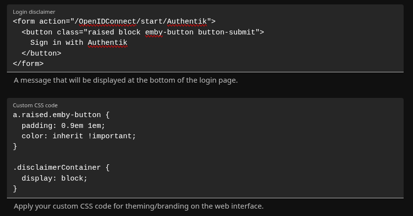

# Examples

## Creating A Login Button On The Main Page

In the Jellyfin administration UI, under "General", there is a "Branding" section. In that section, add the following code in the "Login disclaimer" block (replacing `PROVIDER_NAME` and the domain):

```html
<form action="/OpenIDConnect/start/PROVIDER_NAME">
  <button class="raised block emby-button button-submit">
    Sign in with SSO
  </button>
</form>
```

Then, add the following code in the "Custom CSS code" section:

```css
a.raised.emby-button {
  padding: 0.9em 1em;
  color: inherit !important;
}

.disclaimerContainer {
  display: block;
}
```



For more information, refer to [issue #16](https://github.com/9p4/jellyfin-plugin-sso/issues/16).