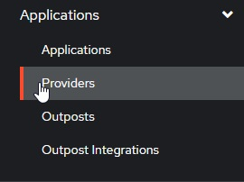

# Provider Specific Configuration

This plugin has been tested to work against various providers, though not all providers provide support for all of this plugins' features.

❗ Before you proceed, make sure you have another admin account if you are going to link SSO provider to the only admin account on the server, permission might get overwritten (see [#212](https://github.com/9p4/jellyfin-plugin-sso/issues/212)).

## TOC / Tested Providers:

❗These providers were tested with the upstream 9p4/jellyfin-plugin-sso plugin, but I've only used Authentik

This section is broken into providers that support Role-Based Access Control (RBAC), and those that do not

### Providers that support RBAC

- ✅ [Authelia](#authelia)
- ✅ [authentik](#authentik)
- ✅ [Keycloak](#keycloak-oidc)
- ✅ [Pocket ID](#pocket-id)

### No RBAC Support

- ✅ Google OIDC
  - ❗ Usernames are numeric
  - ❗ Requires disabling validating OpenID endpoints

## General Options, when RBAC is supported

For any provider that supports RBAC, we can configure it as we see fit:

```yaml
Enabled: true
EnableAuthorization: true
EnableAllFolders: true
EnabledFolders: []
Roles: ["jellyfin_user"]
AdminRoles: ["jellyfin_admin"]
EnableFolderRoles: false
FolderRoleMapping: []
```

## Authelia

Authelia is simple to configure, and RBAC is straightforward.

### Authelia's Config

Below is the `identity_providers` section of an Authelia config:

### Authelia v4.38 and above

```yaml
identity_providers:
  oidc:
    # hmac secret and private key given by env variables
    clients:
      - client_id: jellyfin
        client_name: My media server
        # Client secret should be randomly generated
        client_secret: <redacted>
        token_endpoint_auth_method: client_secret_post
        authorization_policy: one_factor
        redirect_uris:
          - https://jellyfin.example.com/OpenIDConnect/redirect/authelia
```

### Authelia v4.37 and below

```yaml
identity_providers:
  oidc:
    # hmac secret and private key given by env variables
    clients:
      - id: jellyfin
        description: My media server
        # Client secret should be randomly generated
        secret: <redacted>
        authorization_policy: one_factor
        redirect_uris:
          - https://jellyfin.example.com/OpenIDConnect/redirect/authelia
```

### Jellyfin's Config

On Jellyfin's end, we need to configure an Authelia provider as follows:

In order to test group membership, we need to request Authelia's `groups` OIDC scope, which we will use to check user roles.

```yaml
authelia:
  Endpoint: https://authelia.example.com
  ClientId: jellyfin
  Secret: <redacted>
  RoleClaim: groups
  Scopes: ["groups"]
  DisablePushedAuthorization: true
```

## authentik

To begin with, we must set up an OIDC provider + application in authentik. Refer to the official documentation for detailed instruction.

### authentik's Config

- Navigate to `Applications/providers`

  

- Create / Update your Jellyfin OAuth provider
- Verify your **"Redirect URIs/Origins (RegEx)"** follows the format: `https://jellyfin.example.com/OpenIDConnect/redirect/Authentik`.

### Jellyfin's Config

On Jellyfin's end, we need to configure an authentik provider as follows:

In order to test group membership, we need to request authentik's OIDC scope `groups`, which we will use to check user roles.

```yaml
authentik:
  Endpoint: https://authentik.example.com/application/o/jellyfin
  ClientId: <same-as-in-authentik>
  Secret: <same-as-in-authentik>
  RoleClaim: groups
```

If you recieve the error `Error processing request.` from Jellyfin when attempting to login and the Jellyfin logs show `Error loading discovery document: Endpoint belongs to different authority` try setting `Do not validate endpoints` in the plugin settings.

## Keycloak OIDC

Keycloak in general is a little more complicated than other providers. Ensure that you have a realm created and have some usable users.

### Keycloak's Config

Create a new Keycloak `openid-connect` application. Set the root URL to your Jellyfin URL (ie https://jellyfin.example.com)

Ensure that the following configuration options are set:

- Access Type: Confidential
- Standard Flow Enabled
- Redirect URI: https://jellyfin.example.com/OpenIDConnect/redirect/PROVIDER_NAME
- Redirect URI (for Android app): org.jellyfin.mobile://login-callback
- Base URL: https://jellyfin.example.com

Press the "Save" button at the bottom of the page and open the "Credentials" tab. Note down the secret.

For adding groups and RBAC, go to the "mappers" tab, press "Add Builtin", and select either "Groups", "Realm Roles", or "Client Roles", depending on the role system you are planning on using. Once the mapper is added, edit the mapper and ensure that you note down the Token Claim Name as well as enable all four toggles: "Multivalued", "Add to ID token", "Add to access token", and "Add to userinfo" are enabled.

Note that if you are using the template for the "Client Roles" mapper, the default token claim name has `${client_id}` in it. When noting down this value, make sure you note down the actual Client ID (which should be written above).

### Jellyfin's Config

On Jellyfin's side, we need to configure a Keycloak provider as follows:

```yaml
keycloak:
  Endpoint: https://keycloak.example.com/realms/<realm>
  ClientId: <same-as-in-keycloak>
  Secret: <redacted>
  RoleClaim: <same-as-token-claim-name>
```

## Pocket ID

A simple and easy-to-use OIDC provider that allows users to authenticate with their passkeys to your services.

### Pocket ID Config

1. Login to you Pocket ID admin account
1. Go to `Administration -> OCID Clients`
1. Click `Add OCID Client`
1. Give the client a name e.g. `Jellyfin`
1. Set the `Clent Launch URL` to your Jellyfin endpoint
1. Set the callbak url to `https://jellyfin.example.com/OpenIDConnect/redirect/pocketid`. The `pocketid` part must match the `Name of OpenID Provider` in the Jellyfin SSO provider
1. (optional) Enable PKCE if Jellyfin is an https endpoint
1. (optional) Set a logo
1. (optional) Set `Allowed User Groups`

### Jellyfin's Config

```yaml
pocketid:
  Endpoint: https://pocketid.example.com/.well-known/openid-configuration
  ClientId: <pocket-id-client-id>
  Secret: <pocket-id-secret>
```

## Kanidm

Kanidm is a modern and simple identity management platform written in rust.

### Kanidm Config

```shell
kanidm system oauth2 create jellyfin "Jellyfin" https://jellyfin.example.com/

# Set this to drop the trailing @idm.example.com in usernames
kanidm system oauth2 prefer-short-username jellyfin

kanidm system oauth2 add-redirect-url jellyfin https://jellyfin.example.com/OpenIDConnect/redirect/kanidm

# Optionally setup groups for Jellyfin
kanidm group create jellyfin_admins
kanidm group create jellyfin_users

kanidm system oauth2 update-scope-map jellyfin jellyfin_admins openid profile groups
kanidm system oauth2 update-scope-map jellyfin jellyfin_users openid profile groups
```

Get the secret used in the Jellyfin config with `kanidm system oauth2 show-basic-secret jellyfin`.

### Jellyfin's Config

```yaml
kanidm:
  Endpoint: https://idm.example.com/oauth2/openid/jellyfin/
  ClientId: jellyfin
  Secret: <kanidm-secret>
```
